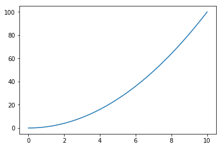

Dette er en testside for introduksjon. Merk at i headeren over (i kildekoden) har vi lagt inn `sidebar_link=true` slik at denne siden kommer opp i venstremenyen. Vi kan fint lage plots, og det kommer fram på nettsiden. 


```python
from pylab import *

a = linspace(0, 10, 100)
b = a**2

plot(a, b)
show()
```





```python

```
